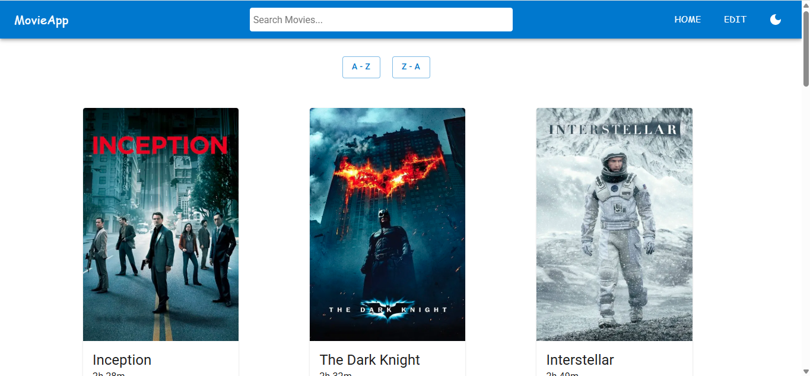
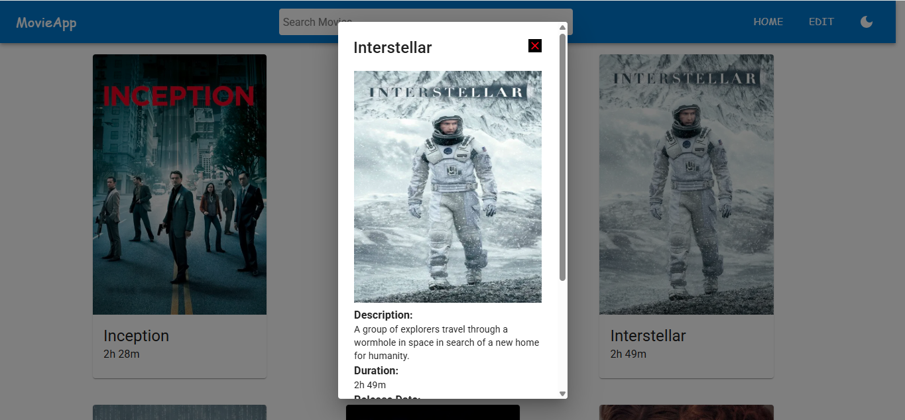
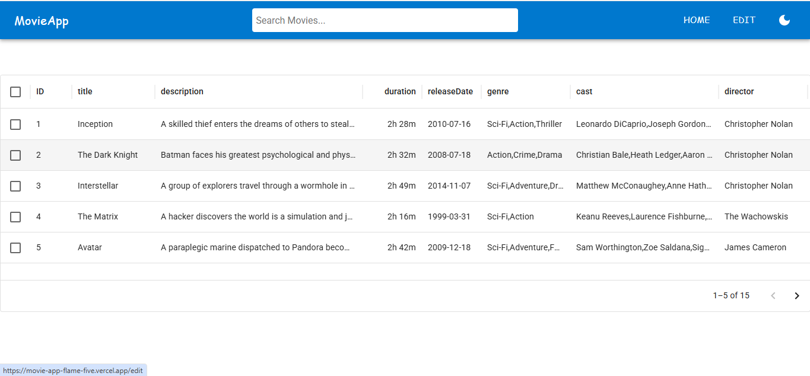

# 🎬 MovieApp

A React-based movie application to explore, view, and manage your favorite movies.  

🌐 **Live Demo**: [MovieApp on Vercel](https://movie-app-flame-five.vercel.app)

---

## 📸 Screenshots  

  
  
  

---

## ⚡ Getting Started

This project was bootstrapped with [Create React App](https://github.com/facebook/create-react-app).

### 🔧 Installation

Clone the repository:

```bash
git clone https://github.com/your-username/movie-app.git
cd movie-app
Install dependencies:

bash
Copy code
npm install
Start the development server:

bash
Copy code
npm start
Now open http://localhost:3000 in your browser.